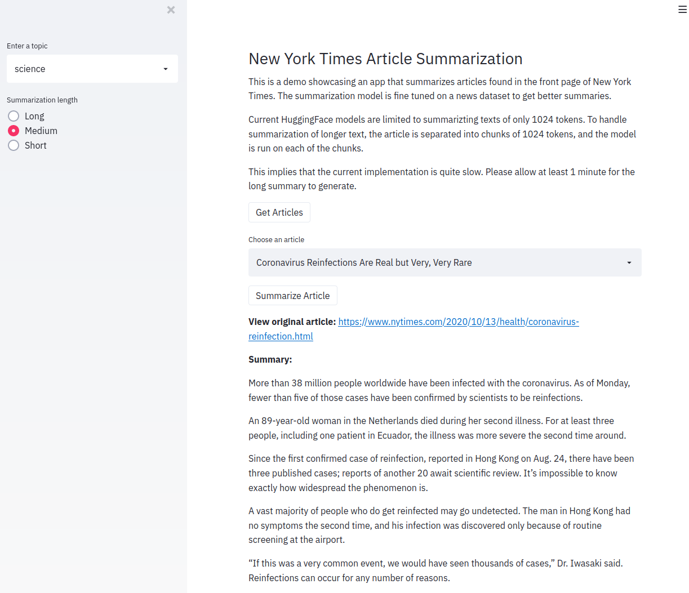

# New York Times Article Summarization App

 

**App link:** https://summarization-app.ue.r.appspot.com/

## Overview

This app summarizes articles found on the front page of The New York Times. For this task, I use HuggingFace's BART model and fine tune it on a news dataset.

Front end is powered by Streamlit and deployed with Docker on Google App Engine. We can also run a Flask server get a summary on a given text.

The project is designed with software engineering principles in mind and includes a modular & extensible training workflow, built-in experiment management, unit tests, linting scripts, automated testing with CircleCI, model versioning and Docker.

NYT api is used to fetch article URLs which are then scraped using BeautifulSoup.

## Data

- [news summarization](https://www.kaggle.com/sunnysai12345/news-summary) dataset is used to fine tune BART model from HugginFace library.
- Performance evaluation is done using the Rouge metric.

## Modular, Extensible design

In this project I use a modular design inspired by [Detectron2](https://github.com/facebookresearch/detectron2) that allows us to plug custom module implementations into almost any part of document summarization system.

See the `utils/registry.py` file, `src/models` folder, and `src/configs` folder to see how this is implemented.

## Experiment Management with Weights and Biases

W & B :

- Keep track of all experiments in one place
- Easily compare runs
- Run multiple experiments from experiments found in src/configs/experiments
- Run sweeps: automated trials of hyper-parameters

## Linting Script

Running `tasks/lint.sh` fully lints our codebase with a few different checkers:

- `pipenv check` scans our Python package dependency graph for known security vulnerabilities
- `flake8` does static analysis of Python files and reports both style and bug problems
- `pycodestyle` checks for simple code style guideline violations (somewhat overlapping with pylint)
- `mypy` performs static type checking of Python files
- `bandit` performs static analysis to find common security vulnerabilities in Python code
- `shellcheck` finds bugs and potential bugs in shell scrips

## Unit Tests

Running `python -m pytest evaluation_tests/evaluate_news_summary.py` evaluates the trained predictors on respective test set, and make sure they are above certain threshold rouge scores.

## Continuous Integration with CircleCI

Pushing a commit will build the jobs in `.circleci/config.yml`. It will automatically run the linting script, unit tests, requirements.txt as well as other checks.

## Run model with Streamlit & Flask api

- Visit https://summarization-app.ue.r.appspot.com/ to run the app.
- Run `streamlit run api/streamlit.py` to launch a local session of a webapp.
- Run `python -m api.app` to run a Flask server which can run a prediction on a given input text.
